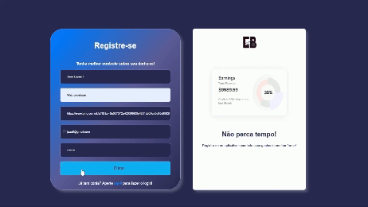
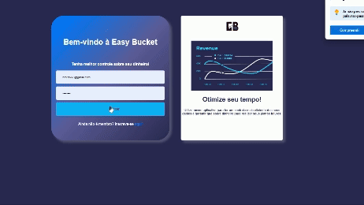
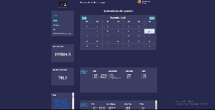
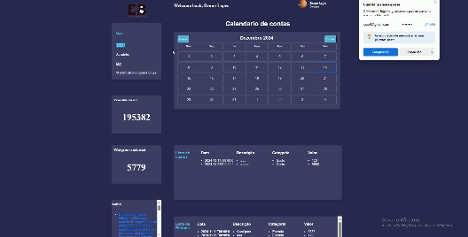
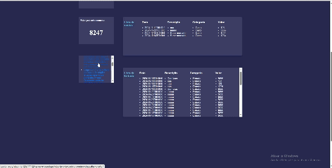

- [Pré-requisitos](#pré-requisito)
- [Descrição do Projeto](#descrição-do-projeto)
- [Tecnologias utilizadas](#tecnologias-utilizadas)

- [Funcionalidades e Demonstração da Aplicação](#funcionalidades-e-demonstração-da-aplicação)
- [Acesso ao Projeto](#acesso-ao-projeto)
- [Pessoas Desenvolvedoras do Projeto](#autores)
- [Conclusão](#conclusão)

# Pré-requisitos

Antes de começar, você vai precisar ter instalado em sua máquina as seguintes ferramentas:
[Git](https://git-scm.com), [Node.js](https://nodejs.org/en/). 
Além disto é bom ter um editor para trabalhar com o código como [VSCode](https://code.visualstudio.com/)

1. Acesse https://github.com/brnlf1990/financial-controler-back-end para configurar o back-end.

2. Baixe o repositório do front-end:
            
            git clone https://github.com/brnlf1990/financial-controler-front-end.git

3. Acesse o diretório financial-project:

        cd financial-project

4. E execute o comando npm install para instalar as dependências listadas no arquivo package.json:
   
        npm install

5. Execute a aplicação:

        npm run start

Se precisar de mais ajuda, é só chamar!

#
# 

# Descrição do Projeto
Projeto criado para um controle das financeiro mais preciso. Nesse projeto tera a pagina principal onde o cliente irá encontrar um calendario que podera interagir com os dias. Cada dia possui uma janela onde os dados sobre controle de gastos ou de entrada será salvo. Após salvo, cada dia irá conter sua própria lista onde o usuario podera verificar seus gastos mais precisamente. O site também tem a lista com todos os itens gastos e  de entrada.
# Tecnologia utilizada:
Front-end:

# :hammer : Funcionalidades do projeto
Abaixo as funcionalidade do site:

- Registro
                
Aqui é onde o usuario cria sua conta, é necessario inserir todos os dados. Colocar um email e no avatar só é aceito um link com uma foto. Após finalizado usuario será redirecionado para a pagina de login e uma mensagem em verde será exibida

  

- Login
Essa pagina onde o usuario irá entrar no aplicativo. Necessário inserir os dados corretamente.

  

- Página principal

Aqui está uma versão ajustada do texto que você forneceu, com uma estrutura mais clara e linguagem refinada:

Após fazer login, o usuário terá acesso ao aplicativo. Ao selecionar um dia no calendário, uma janela será exibida, permitindo que o usuário adicione itens classificados como gastos ou entradas.

Gastos: incluem todas as atividades que resultem na saída de dinheiro.

Entradas: representam qualquer atividade que gere entrada de dinheiro.
Cada janela será uma lista própria, exibindo todas as atividades associadas ao dia selecionado. Ao lado dessa lista, serão apresentados:

O valor total dos gastos.
O saldo atual em caixa.

Além disso, na área abaixo do calendário, haverá listas consolidadas com todos os itens adicionados ao longo dos dias do calendário.

  

- Menu

No menu, o usuário pode navegar para outras páginas. Atualmente, a página Atividades está em construção. Ao clicar nessa opção, uma tela será exibida com a possibilidade de retornar ao Dashboard.

Caso o usuário selecione a opção Sair, ele será deslogado do site, e o token de autenticação será excluído do navegador.

  

- Noticias
Há também uma janela de notícias, onde são exibidas diversas informações relacionadas a negócios. Ao clicar em uma das notícias, será aberta outra página com o site correspondente. Para fornecer essa lista de notícias, foi utilizada uma API de terceiros.

  

# Acesso ao projeto
🏗️ Este setor esta em construção.

# Autores
 [ Bruno Lopes Furuya](https://github.com/brnlf1990) 
# Conclusão

Com essa aplicação Fullstack, meus conhecimentos em React, JavaScript, Node.js, Express.js e MongoDB foram significativamente aprimorados. Aprendi a utilizar o Moment.js, uma biblioteca voltada para a manipulação de calendários e datas. Também aprofundei minha compreensão sobre o método map para iterar em arrays. Meus conhecimentos em manipulação de arrays também evoluíram, e agora compreendo de forma mais eficiente como acessar e trabalhar com os dados contidos dentro de arrays.

Além disso, passei a utilizar o Trello como ferramenta para organizar as tarefas e definir prazos, o que me proporcionou uma visão mais clara sobre como estruturar e planejar o trabalho antes de começar. 

# Getting Started with Create React App

This project was bootstrapped with [Create React App](https://github.com/facebook/create-react-app).

## Available Scripts

In the project directory, you can run:

### `npm start`

Runs the app in the development mode.\
Open [http://localhost:3000](http://localhost:3000) to view it in your browser.

The page will reload when you make changes.\
You may also see any lint errors in the console.

### `npm test`

Launches the test runner in the interactive watch mode.\
See the section about [running tests](https://facebook.github.io/create-react-app/docs/running-tests) for more information.

### `npm run build`

Builds the app for production to the `build` folder.\
It correctly bundles React in production mode and optimizes the build for the best performance.

The build is minified and the filenames include the hashes.\
Your app is ready to be deployed!

See the section about [deployment](https://facebook.github.io/create-react-app/docs/deployment) for more information.

### `npm run eject`

**Note: this is a one-way operation. Once you `eject`, you can't go back!**

If you aren't satisfied with the build tool and configuration choices, you can `eject` at any time. This command will remove the single build dependency from your project.

Instead, it will copy all the configuration files and the transitive dependencies (webpack, Babel, ESLint, etc) right into your project so you have full control over them. All of the commands except `eject` will still work, but they will point to the copied scripts so you can tweak them. At this point you're on your own.

You don't have to ever use `eject`. The curated feature set is suitable for small and middle deployments, and you shouldn't feel obligated to use this feature. However we understand that this tool wouldn't be useful if you couldn't customize it when you are ready for it

## Learn More

You can learn more in the [Create React App documentation](https://facebook.github.io/create-react-app/docs/getting-started).

To learn React, check out the [React documentation](https://reactjs.org/).

### Code Splitting

This section has moved here: [https://facebook.github.io/create-react-app/docs/code-splitting](https://facebook.github.io/create-react-app/docs/code-splitting)

### Analyzing the Bundle Size

This section has moved here: [https://facebook.github.io/create-react-app/docs/analyzing-the-bundle-size](https://facebook.github.io/create-react-app/docs/analyzing-the-bundle-size)

### Making a Progressive Web App

This section has moved here: [https://facebook.github.io/create-react-app/docs/making-a-progressive-web-app](https://facebook.github.io/create-react-app/docs/making-a-progressive-web-app)

### Advanced Configuration

This section has moved here: [https://facebook.github.io/create-react-app/docs/advanced-configuration](https://facebook.github.io/create-react-app/docs/advanced-configuration)

### Deployment

This section has moved here: [https://facebook.github.io/create-react-app/docs/deployment](https://facebook.github.io/create-react-app/docs/deployment)

### `npm run build` fails to minify

This section has moved here: [https://facebook.github.io/create-react-app/docs/troubleshooting#npm-run-build-fails-to-minify](https://facebook.github.io/create-react-app/docs/troubleshooting#npm-run-build-fails-to-minify)
